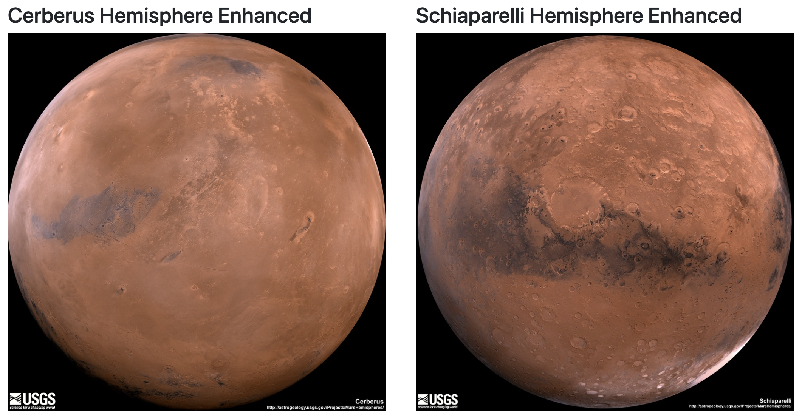

<h1> web-scraping-challenge </h1>
Built a web application that scrapes various websites for data related to the Mission to Mars and displays the information in a single HTML page.

<h1>Step 1 - Scraping</h1>

Initital scraping was done using Jupyter Notebook, BeautifulSoup, Pandas, and Requests/Splinter.

Created a Jupyter Notebook file called mission_to_mars.ipynb and used it to complete all scraping and analysis tasks. 

<strong>The following outlines what was scraped:</strong>

<strong>NASA Mars News</strong>
The first scrape is from the Nasa Mars site and consisted of the both the latest News Title and Paragraph Text.

  
   

<strong>JPL Mars Space Images - Featured Image</strong>                                 
The second srape is of the JPL Featured Space Image.  Splinter was used to navigate the site and find the image url for the current Featured Mars Image.  Once found, the image url string was assigned a variable called featured_image_url.

  
   

                                      
                                       

<strong>Mars Facts</strong>
- The third scrape is from the Mars Facts webpage and is a table of relevant facts.  Pandas was used to scrape the table containing facts about the planet and data was then converted to an HTML table string.

  
   

 

Mars Hemispheres
- The third scrape is from the USGS Astrogeology site and consists of high resolution images for each of Mar's hemispheres.  A python dictionary was used to store the the data with a list containing one dictionary for each hemisphere.  A for loop was used to append each dictionary with the hemisphere title and url string.

  
   

Step 2 - MongoDB and Flask Application

MongoDB with Flask templating was used to create a new HTML page that displays all of the scraped information collected above.

The initial jupyter notebook was converted into a Python script called scrape_mars.py with a function called scrape that executes the code above and returns one Python dictionary containing all of the scraped data.

Next, a route called scrape_mars.py was created to call the scrape function and the data was returned and stored in Mongo as a Python dictionary.

Lastly, an html template was created to display the data passed on from the Mongo database.  

